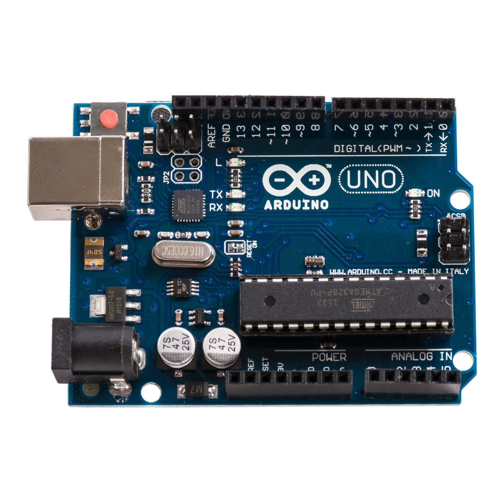
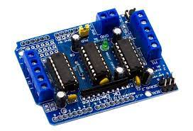
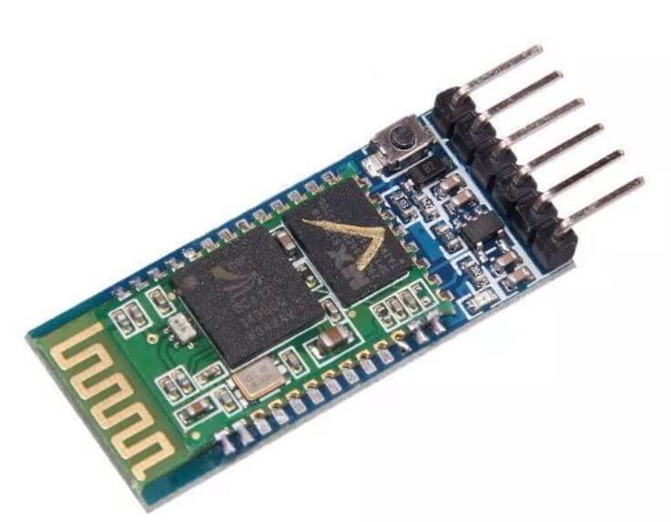
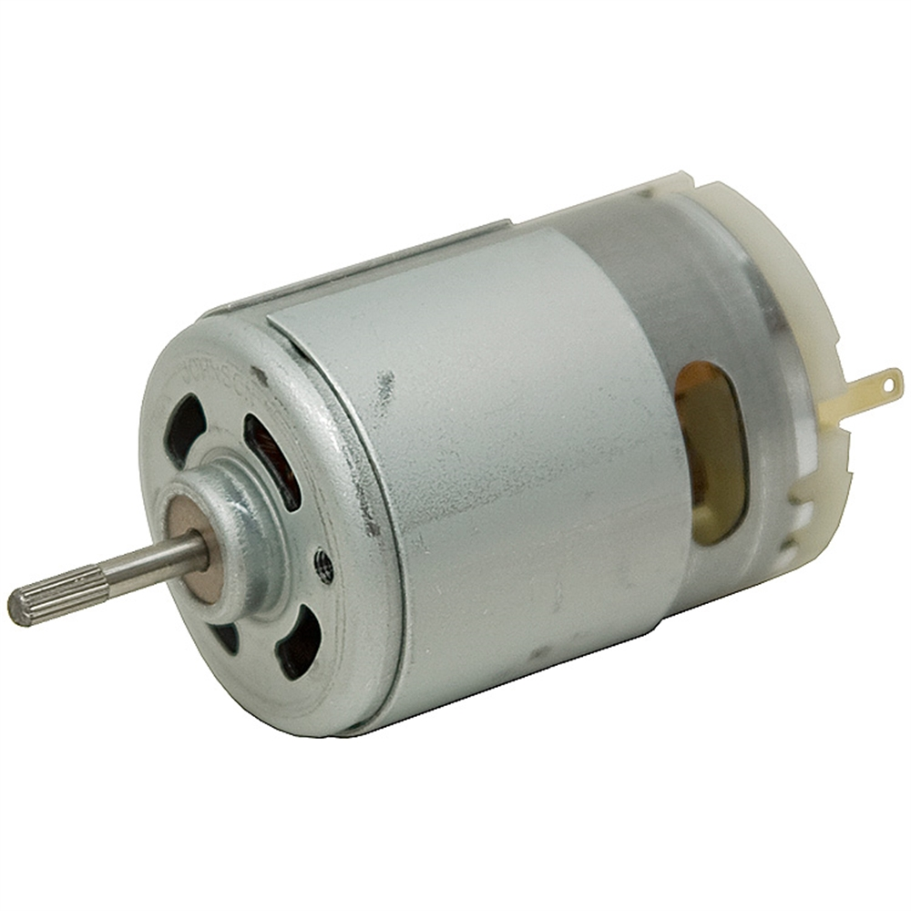
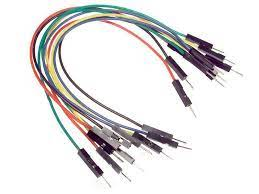
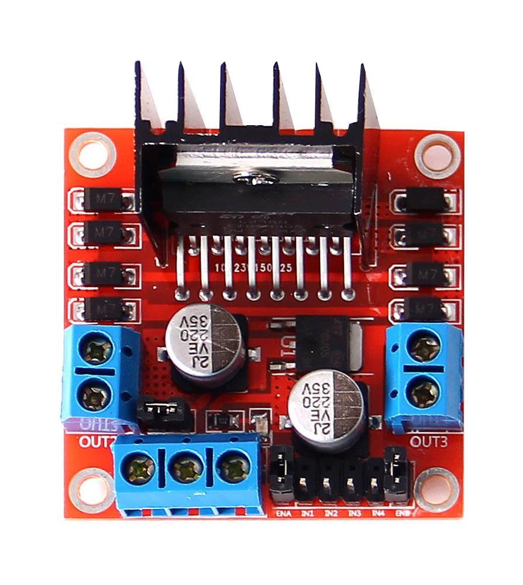
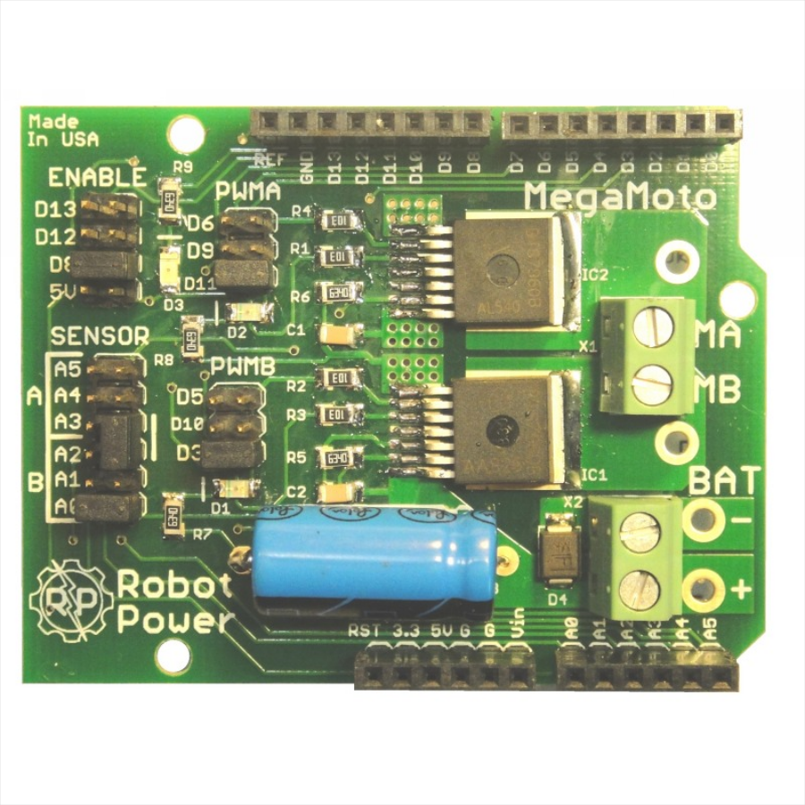
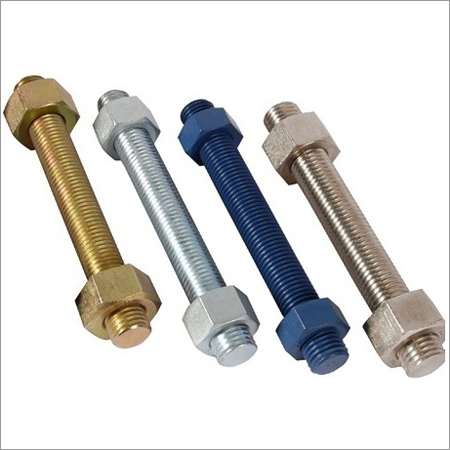

# Soccer Robot

### Introduction :
- A specialized mobile robot that is used to play variants of soccer is termed as `Soccer Robot`.

### Parts :
- Chassis
- Clamp
- Stud
- Motor
- Wheel
- Arduino
- Arduino Shield
- Motor Driver
- Motor Driver Shield
- Bluetooth Module
- Jumper Wires
- Battery
- Screws
- `For Kicking Mechanism` :
    - Rack and Pinning Technique(Parts) :
        - Pin Gear
        - Catapult Rubber

### Process :
- Firstly the Chassis was made using ply of size 20*17cm.
- Clamp was made using aluminium sheet to hold the motor.
- In first layer :
    - Motor was fixed in the chasis using clamp.
    - Battery was also placed maintaining CG.
    - Wheel was fixed in motor.
    - To hold next layer, we drilled in the chassis according to the stud size.
- In second layer :
    - Arduino, Arduino Shield, Motor Driver, Motor Driver Shield & Bluetooth module was connected using the Jumper wires and some of them were soldered(Either motor driver or ardiuno shield was used).
    - A tin plate was used to protect the electronic components from any damages.

# Images :
### Arduino Board

### ArduinoShield

### Bluetooth Module

### DC Motor

### Jumper

### Motor Driver

### Motor Shield

### Rack Slider

### Rack

### Stud
